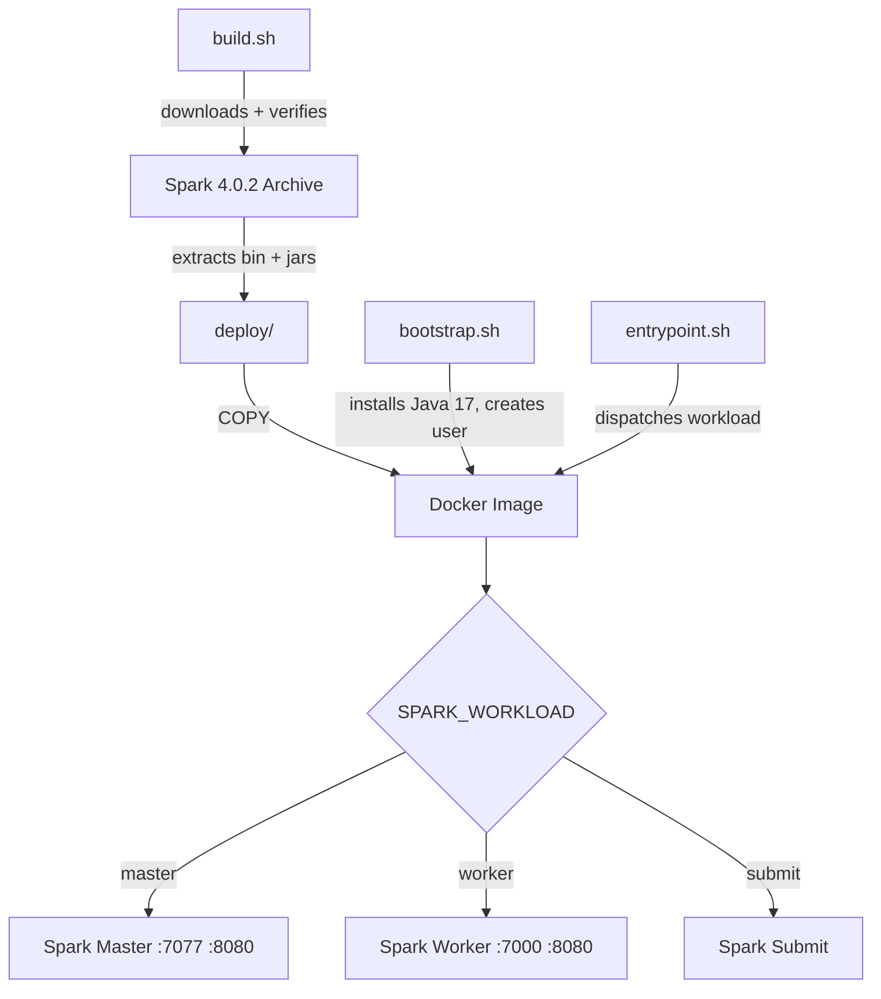

# Spark Docker Image


Dockerized Apache Spark 4.0.2 standalone cluster running on Oracle Linux 9 with Java 17.

## Overview

This project packages Apache Spark into a Docker image that can run as a standalone master, worker, or submit client. The container dispatches the correct Spark process at startup based on the `SPARK_WORKLOAD` environment variable, making it easy to spin up a full Spark cluster using Docker Compose or Kubernetes.

The image is built on Oracle Linux 9 slim for a small footprint, includes GPG-verified Spark binaries, and runs as a non-root user for security.

## Technology Stack

| Component | Version | Purpose |
|---|---|---|
| Apache Spark | 4.0.2 | Distributed data processing engine |
| Java (OpenJDK) | 17 | Spark runtime |
| Hadoop | 3 (bundled) | Filesystem and YARN libraries |
| Oracle Linux | 9-slim | Minimal container base image |
| Scala | 2.13 (bundled) | Spark's internal language |

## Architecture



## Getting Started

### Prerequisites

- [Docker](https://docs.docker.com/get-docker/)
- [just](https://github.com/casey/just) (task runner)
- GPG (for Spark archive verification during build)

### Build

```bash
just build
```

This downloads and GPG-verifies the Spark 4.0.2 archive, extracts the required `bin/` and `jars/`, and builds the Docker image.

### Run

```bash
# Run as master (default)
just run master

# Run as worker
just run worker
```

### Manual Docker Commands

```bash
# Build
docker build -t kagaston/spark:latest .

# Run master
docker run --rm -e SPARK_WORKLOAD=master -p 7077:7077 -p 8080:8080 kagaston/spark:latest

# Run worker (connect to master)
docker run --rm -e SPARK_WORKLOAD=worker -e SPARK_MASTER=spark://spark-master:7077 kagaston/spark:latest
```

## Configuration

### Environment Variables

| Variable | Default | Description |
|---|---|---|
| `SPARK_WORKLOAD` | `master` | Workload type: `master`, `worker`, or `submit` |
| `SPARK_MASTER` | `spark://spark-master:7077` | Master URL (used by workers) |
| `SPARK_MASTER_PORT` | `7077` | Master RPC port |
| `SPARK_MASTER_WEBUI_PORT` | `8080` | Master web UI port |
| `SPARK_WORKER_WEBUI_PORT` | `8080` | Worker web UI port |
| `SPARK_WORKER_PORT` | `7000` | Worker port |

### Exposed Ports

| Port | Purpose |
|---|---|
| `7077` | Spark master RPC |
| `8080` | Web UI (master or worker) |
| `7000` | Spark worker |

## Project Structure

```
spark/
├── Dockerfile                   # Multi-stage image build (base → runtime)
├── .dockerignore                # Build context exclusions
├── .hadolint.yaml               # Dockerfile linting config
├── justfile                     # Task runner recipes
├── structure-test.yaml          # Container structure tests
├── scripts/
│   ├── bootstrap.sh             # Container provisioning (Java 17, user creation)
│   ├── build.sh                 # Download + GPG-verify Spark, extract artifacts
│   └── entrypoint.sh            # Runtime workload dispatcher (master/worker/submit)
├── .github/
│   ├── workflows/ci.yml         # CI pipeline: lint → build → scan → push
│   ├── pull_request_template.md
│   ├── CODEOWNERS
│   └── ISSUE_TEMPLATE/
├── CONTRIBUTING.md
└── README.md
```

## Development

### Commands

| Command | Purpose |
|---|---|
| `just build` | Download Spark and build Docker image |
| `just run` | Run container (default: master) |
| `just lint` | Lint Dockerfile + shell scripts |
| `just format-shell` | Format shell scripts with shfmt |
| `just test-structure` | Run container structure tests |
| `just preflight` | Run all quality checks |
| `just clean` | Remove build artifacts |

### Linting and Formatting

```bash
just lint          # hadolint + shellcheck
just format-shell  # shfmt (2-space indent)
just lint-yaml     # yamllint
```

### Testing

Container structure tests validate the built image's metadata, file system, environment variables, and installed packages.

```bash
just build
just test-structure
```

## Contributing

See [CONTRIBUTING.md](CONTRIBUTING.md) for setup, workflow, and commit conventions.

## License

This project is licensed under the MIT License.
